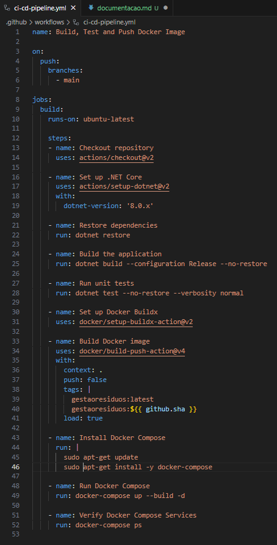
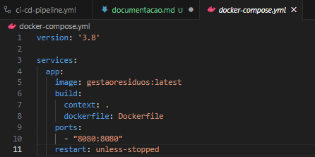
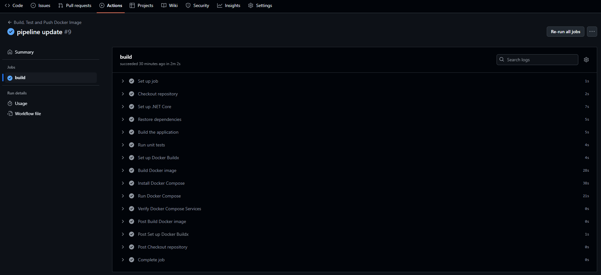
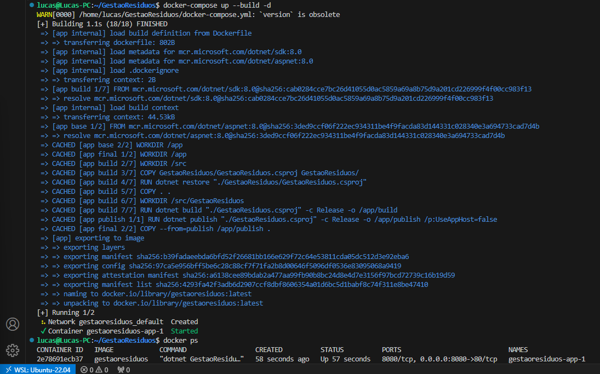
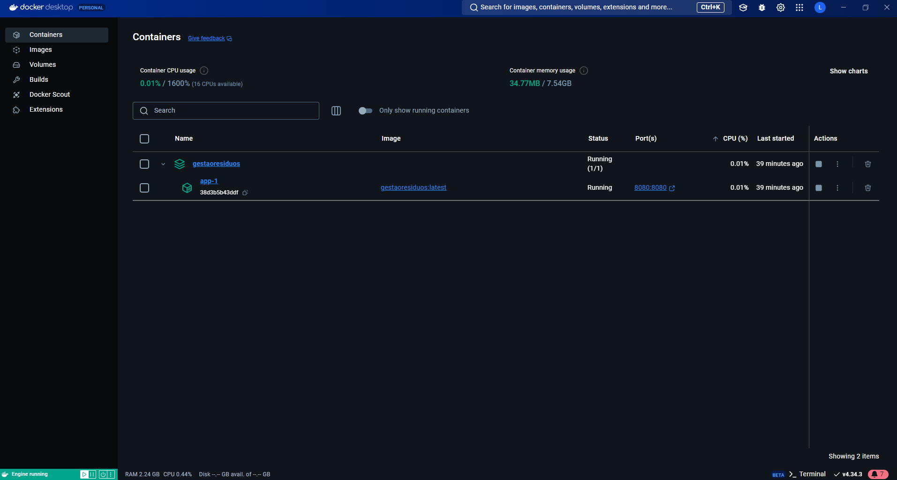
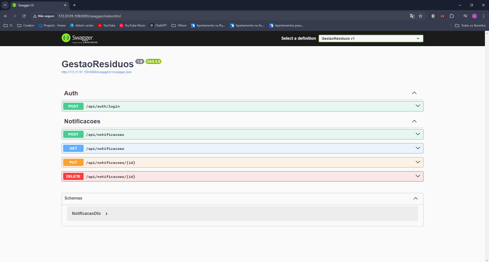

# Documentação do Projeto de DevOps

## Introdução
Este documento tem como objetivo descrever em detalhes o processo de integração e entrega contínua (CI/CD) e a containerização da aplicação desenvolvida, que faz parte do desafio DevOps focado em soluções para Cidades Inteligentes. A seguir, serão abordadas as etapas do pipeline de CI/CD, a estratégia de containerização, e as evidências de execução para assegurar a eficácia do processo.

## 1. Etapas e Componentes do Pipeline de CI/CD

### 1.1. Ferramentas Utilizadas
- **GitHub Actions**: Utilizado para automatizar o processo de CI/CD.
- **Docker**: Para construir imagens da aplicação.
- **Docker Compose**: Para orquestrar os serviços da aplicação.

### 1.2. Etapas do Pipeline
1. **Checkout do Repositório**: A primeira etapa do pipeline é clonar o repositório do GitHub para garantir que a versão mais recente do código esteja disponível.
2. **Configuração do .NET Core**: Instalação do ambiente para compilar a aplicação, utilizando a versão 8.0 do .NET.
3. **Restaurar Dependências**: Restaura todas as dependências do projeto para garantir que o código possa ser compilado sem erros.
4. **Build da Aplicação**: Compilação do projeto em modo Release, gerando os binários necessários.
5. **Execução dos Testes Unitários**: Garante que as funcionalidades da aplicação estejam funcionando como esperado antes de prosseguir para o próximo passo.
6. **Configuração do Docker Buildx**: Configura o Buildx para a construção da imagem Docker.
7. **Build da Imagem Docker**: Constrói a imagem Docker e carrega a imagem no ambiente local, próximo passo do ciclo de vida.
8. **Orquestração com Docker Compose**: Inicializa os serviços definidos no `docker-compose.yml`.
9. **Verificação dos Serviços**: Verifica se os serviços estão em execução corretamente após a orquestração.

## 2. Estratégia de Containerização

### 2.1. Relevância para o DevOps
A containerização da aplicação foi feita utilizando **Docker**, garantindo que o ambiente da aplicação seja replicável e consistente. Essa abordagem facilita a entrega contínua, pois elimina os problemas relacionados a diferentes ambientes de desenvolvimento e produção, garantindo que a aplicação funcione da mesma forma em qualquer lugar.

### 2.2. Orquestração com Docker Compose
O **Docker Compose** é utilizado para gerenciar vários contêineres que compõem a aplicação. Isso inclui o contêiner principal da aplicação e outros serviços necessários, como bancos de dados e ferramentas de monitoração. O Compose ajuda a simplificar o processo de inicialização e parar todos os serviços em um único comando.

## 3. Evidências de Execução

### 3.1. Prints dos Passos de Configuração
Abaixo, seguem as evidências de configuração do pipeline e das etapas de execução:

- **Configuração do GitHub Actions**: Captura de tela mostrando a configuração do YAML do pipeline.
  

- **Configuração do Docker Compose**: Captura de tela mostrando a orquestração dos serviços e a execução dos comandos `docker-compose up`.

### 3.2. Evidências de Funcionamento
- **Execução do Pipeline**: Prints mostrando o pipeline executando as etapas de build, testes, e orquestração.

- **Serviços Ativos**: Capturas de tela dos contêineres rodando e a aplicação acessível no navegador.

## Conclusão
A documentação detalhou todas as etapas do processo de CI/CD, desde o checkout do código até a verificação dos serviços em execução. A estratégia de containerização utilizando Docker e Docker Compose permite um ciclo de vida da aplicação ágil e com menos riscos, garantindo um ambiente consistente entre desenvolvimento, staging e produção.
